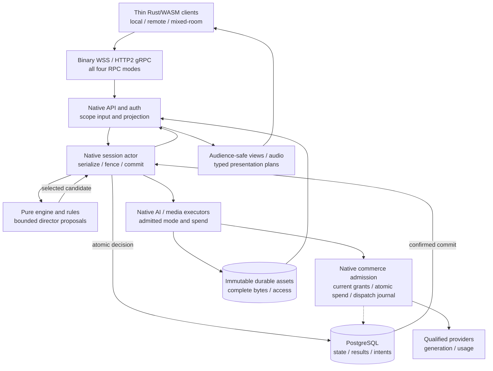
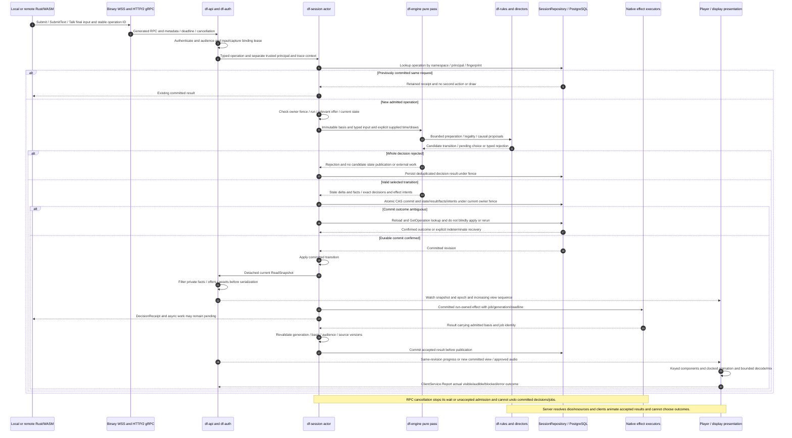
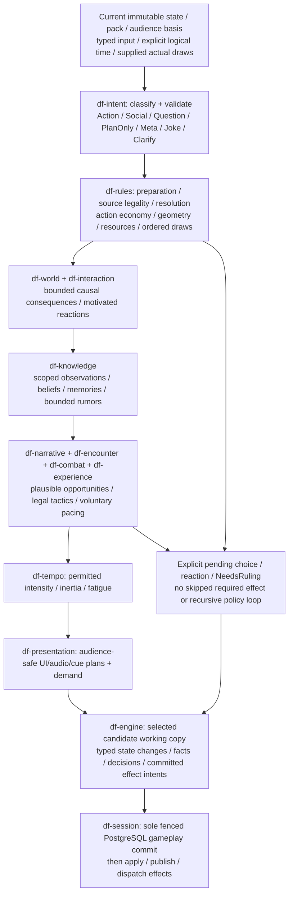
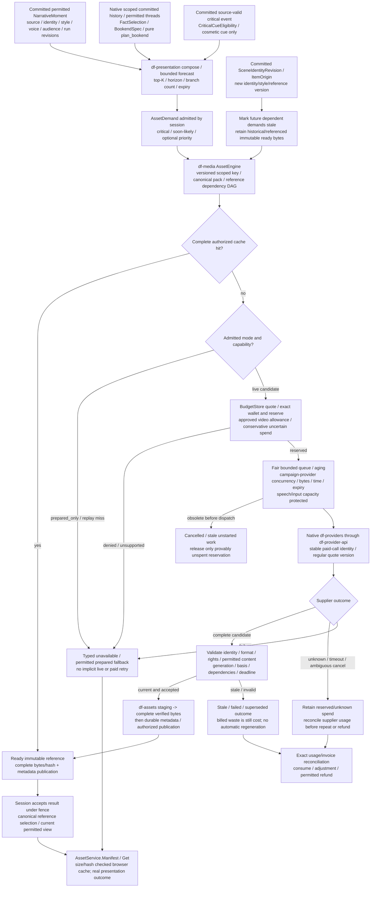
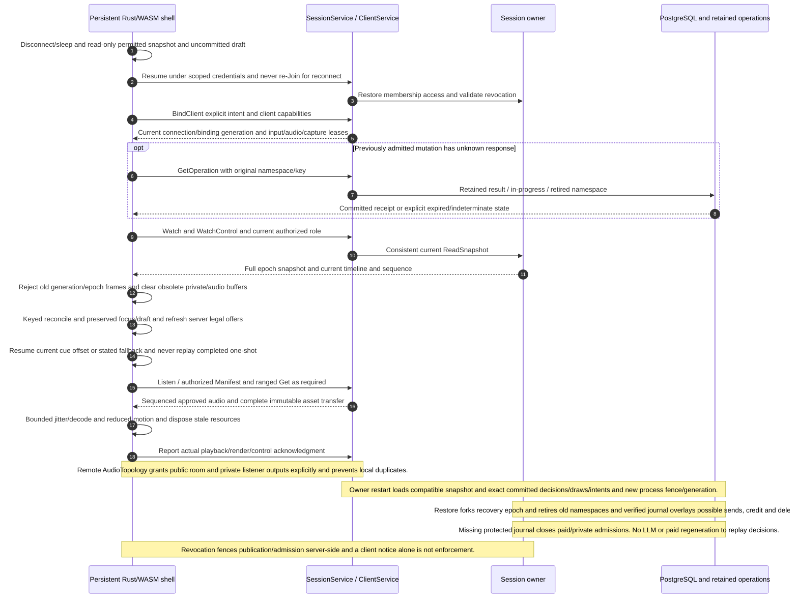
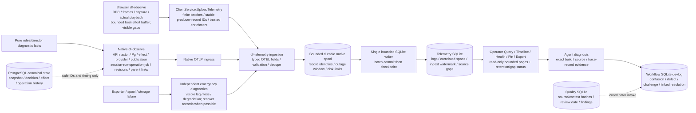
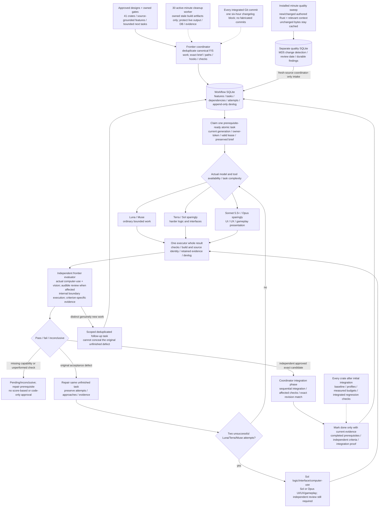

# DungeonFlux engine overview

Date: 2026-09-30
Status: **Planned architecture.** The Rust game, server, WASM clients and runtime
stores are unimplemented. The planning SQLite, quality cache/helper and retained
design reviews exist separately. Diagrams describe intended contracts and flows.

Start with the compact control-flow map, then follow the action and recovery sequences.
The exact 41-crate import DAG is at the end. Runtime arrows mean communication,
composition or data flow; they are **not Cargo dependencies**. Pure subsystems
exchange typed proposals through the engine, not recursive calls to each other.
All runtime boxes initially compose into one native backend process; a crate or
RPC service does not imply another deployed service.

Governed by [Subsystem architecture](subsystem-architecture.md),
[Subsystem interfaces](subsystem-interfaces.md), [Runtime directors](runtime-directors.md),
[RPC API](rpc-api.md) and [Implementation roadmap](implementation-roadmap.md).

## Control flow at a glance

This compact path is the entry point. Native adapters supply consumer-owned ports;
the pure engine cannot perform I/O. The larger maps below preserve every crate.

## Whole engine: the 41 subsystem crates

Solid arrows show the principal runtime path. Dotted arrows show supplied wiring,
shared contracts or supporting infrastructure. Store cylinders are external
resources, not additional crates. The full map and exact import DAG need zooming at native SVG size; use the focused
flow diagrams for a readable single path. The two browser roles share a persistent
Rust/WASM shell and have no local rules or authoritative game state.

```mermaid
flowchart TB
  subgraph BROWSER["Rust source / WASM browser clients"]
    WEB["df-web<br/>boot / routes / persistent composition"]
    PLAYER["df-player<br/>phone / tablet / laptop<br/>local or hosted-remote private view"]
    DISPLAY["df-display<br/>TV / projector / laptop group view"]
    UI["df-ui<br/>tokens / widgets / permitted host panel"]
    CLIENT["df-client<br/>RPC / freshness / scoped asset cache"]
    RENDER["df-render<br/>flat scenes / animations / optional 3D"]
    AUDIO["df-audio<br/>capture / decode / mixer / playback"]
    WEB --> PLAYER & DISPLAY
    PLAYER & DISPLAY --> UI & CLIENT & RENDER & AUDIO
  end
  subgraph SHARED["Shared contracts; no gameplay in browser imports"]
    TYPES["df-types<br/>IDs / units / revisions / provenance"]
    PROTOCOL["df-protocol<br/>generated protobuf / RPC contracts"]
    LOCALE["df-locale<br/>catalogs / formatting / negotiation"]
    BRIDGE["df-rpc-bridge<br/>bounded WebSocket byte stream"]
    OBSERVE["df-observe<br/>OTEL context / export and ingress ports"]
  end
  CLIENT <--> BRIDGE
  PROTOCOL -.-> CLIENT
  TYPES -.-> CLIENT
  LOCALE -.-> UI
  OBSERVE -.-> CLIENT
  subgraph NATIVE["One native Rust backend; separate authorities"]
    SERVER["df-server<br/>bootstrap / listener and port wiring / readiness / shutdown"]
    API["df-api<br/>generated handlers / audience-safe DTO projection"]
    AUTH["df-auth<br/>recoverable identity / tenant / capabilities"]
    COMMERCE["df-commerce<br/>pure entitlement / exact ledger policy<br/>native facade supplied separately"]
    SESSION["df-session<br/>one serialized actor per session<br/>sole fenced gameplay decision writer"]
    ENGINE["df-engine<br/>bounded pure staged transition composition"]
    subgraph PURE["Pure domain and directors; no DB / network / clocks / paid calls"]
      MODEL["df-model<br/>state / inputs / proposals / persisted versions"]
      CONTENT["df-content<br/>immutable validated packs / source catalogs / policies"]
      RULES["df-rules<br/>2024 legality / dice / costs / choices / effects"]
      WORLD["df-world<br/>causality / logical time / travel / schedules"]
      KNOWLEDGE["df-knowledge<br/>scoped facts / beliefs / memories / rumor policy"]
      INTENT["df-intent<br/>disposition / bounded semantic plan validation"]
      INTERACTION["df-interaction<br/>NPC motivation / topics / relationships / obligations"]
      NARRATIVE["df-narrative<br/>beats / threads / agency / convergence budget"]
      ENCOUNTER["df-encounter<br/>source-legal challenges / objectives / escape"]
      COMBAT["df-combat<br/>legal NPC tactics / perceived battlefield"]
      EXPERIENCE["df-experience<br/>macro pacing / voluntary spotlight"]
      TEMPO["df-tempo<br/>permitted intensity / inertia / fatigue"]
      PRESENT["df-presentation<br/>audience-safe plans / cues / bounded demand"]
    end
    AI["df-ai<br/>validated text / semantic and content candidates"]
    MEDIA["df-media<br/>AssetEngine / speech / bookends / bounded cinema"]
    PROVIDER_API["df-provider-api<br/>provider / budget / recording contracts"]
    PROVIDERS["df-providers<br/>native vendor adapters / capability configuration"]
    ASSETS["df-assets<br/>complete immutable bytes / authorized manifests"]
    PERSIST["df-persistence<br/>native PostgreSQL consumer-port adapters"]
  end
  BRIDGE <--> API
  SERVER -.-> BRIDGE & API & SESSION & PERSIST & AI & MEDIA & PROVIDERS
  API --> AUTH
  API -->|"CustomerService / native facade"| COMMERCE
  COMMERCE -->|"supplied repository / gateway"| PERSIST & PROVIDERS
  API --> SESSION
  SESSION --> ENGINE
  MODEL -.-> ENGINE
  CONTENT -.-> ENGINE
  ENGINE --> RULES & WORLD & KNOWLEDGE & INTENT & INTERACTION
  ENGINE --> NARRATIVE & ENCOUNTER & COMBAT & EXPERIENCE & TEMPO & PRESENT
  ENGINE --> SESSION
  SESSION -->|"commit_decision port / owner fence"| PERSIST
  SESSION -->|"committed effect / supplied executor"| AI & MEDIA
  AI & MEDIA -->|"bounded provider and spend ports"| PROVIDER_API
  PROVIDER_API -.->|"commerce ledger adapter / dispatch permit"| COMMERCE
  PROVIDER_API -.-> PROVIDERS
  MEDIA --> ASSETS
  API -->|"permitted byte transfer"| ASSETS
  SESSION -->|"consistent ReadSnapshot"| API
  API -->|"authorized view / control / audio"| BRIDGE
  PERSIST --> PG[("PostgreSQL<br/>canonical state / decisions / operations / jobs<br/>membership / memories / budget metadata")]
  ASSETS --> BYTES[("Durable immutable asset bytes<br/>proposed protected object backing / access")]
  PROVIDERS --> VENDORS["Qualified external providers<br/>text / STT / TTS / image / video / sound"]
  subgraph DEVELOPMENT["Tooling and evidence; separate from gameplay authority"]
    TELEMETRY["df-telemetry<br/>OTLP / durable spool / SQLite / operator review"]
    TESTKIT["df-testkit<br/>test-only clocks / draws / fakes / replay fixtures"]
    TOOLS["df-tools<br/>dfctl / build / author / import / media / preview"]
    WORKFLOW["df-workflow<br/>planned Rust coordinator / leases / independent review"]
  end
  OBSERVE --> TELEMETRY
  SERVER -.-> TELEMETRY
  TOOLS -.-> CONTENT & ASSETS & PROVIDERS
  TESTKIT -.-> ENGINE & SESSION
  WORKFLOW -.-> TOOLS
  TELEMETRY --> OTEL_DB[("Separate telemetry SQLite<br/>logs / correlated spans / watermarks / gaps")]
  WORKFLOW --> QUEUE_DB[("Workflow SQLite<br/>features / tasks / dependencies / attempts / devlog")]
  QUALITY["Installed personal quality helper<br/>one-minute heartbeat / scoped findings"] --> QUALITY_DB[("Separate quality SQLite<br/>hash / review date / history / findings")]
  QUALITY -.->|"coordinator-only idempotent intake"| WORKFLOW
```

`df-server` wires implementations into consumer-owned ports; the runtime
`df-session → df-persistence` communication does not add that Cargo import.
`df-session` owns gameplay decision commits; credential, asset publication and
budget adapters also perform their distinct authorized native storage operations.
A host panel can mount on either client role after authorization. Shared display
is not an omniscient GM screen. Generated JavaScript is limited to WASM/browser
binding glue; Rust owns application logic and UI.

## Input, RPC, decision and presentation

This path covers typed offers, text and final transcribed voice. Partial transcripts,
questions, jokes and plan-only text cannot silently authorize a game action.
Authorization is separate from correlation metadata. See [RPC transport](rpc-transport.md),
[Client presentation](client-presentation.md) and [Rules effects](rules-effect-model.md).

Hosted remote and mixed-room play are required core under [Remote play](remote-play.md),
using the same WSS/RPC/session actor. `RemotePlayPolicy`, observed presence and
`AudioTopology` explicitly grant room-output, capture and private-listener leases.
A remote player hears permitted public narration and their own private audio;
private whispers never route to a TV through audio, captions, asset demand or tempo.
Unavailable private headphone playback falls back to authorized text. AFK and
host pause/takeover are disclosed consented policy, never inactivity penalties or
new D&D deadlines. Actual independently networked device/audio evidence is required.

[Feature refinement](feature-refinement.md) adds server-owned
`ContextualPrivateOffer` / `KnowledgeCue` and voluntary spotlight preferences.
Private disclosure to the party is an explicitly validated action, not automatic
consent from knowing a secret. Phones retain all legal choices and accessible
input when tempo is quiet; intensity cannot invent a timer or conceal an option.

## Pure engine composition and mechanical authority

The arrows here express ordered typed values within one candidate. They do not
import directors into each other or give directors their own timers/writers.
A proposal requiring another action, reaction, choice or ruling becomes persisted
pending resolution; it is not an unlimited recursive policy pass.

All shared persisted domain records belong to `df-model`; authoring policies belong
to `df-content`. NPC beliefs can be false; canonical truth changes only through
accepted authoritative transitions. Narrative scores, social relationships and
musical intensity cannot become invented D&D bonuses. World logical time advances
through accepted travel/rest/time changes; wall-time pause and presentation clocks
are separate. Rules coverage requires pinned full selected 2024 sources/catalogs,
not merely a list of spell names or an SRD subset.

The bounded candidate order is input disposition → rules preparation/resolution →
world and NPC consequences → knowledge updates → narrative/encounter/combat/
experience recommendations → tempo → permitted presentation. Pending choices,
reactions and rulings suspend explicitly before the sole session commit.

## Long-horizon memory and authoring

Native retrieval supplies a bounded authorized batch. Pure `df-knowledge` validates
its basis/access and ranks supplied candidates; it does not query a database.
Index scores and summaries remain derived aids, never canonical truth or replay
history. See [Long-horizon state](long-horizon-state.md),
[Campaign authoring](campaign-authoring.md) and [Interaction engine](interaction-engine.md).

```mermaid
flowchart LR
  subgraph AUTHOR["Private bounded authoring; X10 / G03 / G07 / G10"]
    GEN["Admitted native df-ai ContentCandidate<br/>no live executable rule or inventory entry"] --> DRAFT
    RAW["Authorized lore / templates / allowlisted import<br/>rights / namespace / depth-byte-item limits"] --> TOOL["df-tools import / author / validate / package"]
    TOOL --> DRAFT["DraftRevision / ImportReport<br/>LLM extraction is an unconfirmed candidate"]
    DRAFT --> VALID["df-content pure validation<br/>references / alternatives / secrets / source compatibility / fallback DAG"]
    VALID -->|"existing approved source definitions"| PACK
    VALID -->|"new generated definition"| MECH["Pure df-rules source-handler validation<br/>ContentValidation / legal effect and resource interactions"]
    MECH --> APPROVE["ContentAdmission<br/>approved standard template or disclosed opt-in custom RulesetId<br/>unsupported mechanics remain a gap"]
    APPROVE --> PACK["Immutable CampaignPackage / ValidatedPack<br/>schema / rules / source / policy / access hashes"]
    PACK --> PUB["Native complete publication<br/>private metadata / durable bytes; no arbitrary code or fetching"]
    PUB --> ACT["Authorized ActivateContent via session owner<br/>new-run pin or explicit dry-run migration and fenced checkpoint"]
  end
  ACT --> CANON[("PostgreSQL<br/>canonical facts / committed episodes / grants / pack version")]
  subgraph MEMORY["Native retrieval and pure knowledge policy"]
    QUERY["df-session MemoryCandidateStore port<br/>AuthorizedMemoryQuery / observer / purpose / budgets"] --> ADAPTER["df-persistence bounded scoped Pg query / replaceable index"]
    CANON --> ADAPTER
    ADAPTER --> BATCH["MemoryCandidateBatch / source + index generation<br/>MemoryCandidatesReady admitted basis"]
    BATCH --> PUREK["df-knowledge rank_candidates<br/>current reauthorization / deterministic ties / item-byte-token limits"]
    PUREK --> RESULT["Attributed permitted snippets / references / explicit incomplete result"]
    RESULT --> CONTEXT["Engine/NPC/AI permitted context<br/>no hidden fact / raw unbounded transcript"]
  end
  CANON --> CONSOL["Budgeted native consolidation / optional qualified embedding jobs<br/>source/access/index generation pinned; no replay generation"]
  CONSOL --> REVIEW["Session revalidates derived candidate<br/>contradiction quarantined / missing provenance explicit"]
  REVIEW --> CANON
```

Replay loads the committed package hash and exact accepted semantic decisions. It
never reimports lore, regenerates summaries to reconstruct truth or rerolls dice.
Index rebuilds are optional native work after qualified contracts; publication and
revocation revalidate source/access/index generations atomically. Active/scheduled/
dormant simulation tiers and bounded due-event continuations prevent one LLM loop
per NPC or unbounded catch-up when a campaign resumes.

[Generated content](generated-content.md) reuses this producer boundary. Immutable
`ContentAdmission` binds definition/source/handler versions and deduplicated
award/spawn identity; engine/session revalidate current basis before committing it.
Standard-compatible templates personalize origin, names and media. Novel mechanics
need reviewed deterministic handlers, a separate custom `RulesetId`, explicit
campaign opt-in and participant disclosure. Host approval cannot implement a
missing handler or turn a custom rule into standard support. Arbitrary uploaded
Rust/WASM/JS or DSL execution remains forbidden. Boss phases/hazards use approved
encounter/rules templates; no LLM invents HP, immunity, summons or geometry.
Provider failure cannot revoke a committed award or withhold source-required
progression/rewards; use permitted prepared cosmetics and preserve due mechanics.

## Asset Engine, spend and speculative futures

Forecasts are server-private heuristics. A ready predicted asset cannot canonize a
future event or expose that branch via a manifest, cue or music choice. The generator
never owns game consequences. See [Asset engine](asset-engine.md),
[Asset provider research](asset-provider-research.md) and [Pricing and costs](pricing-and-costs.md).

Ordinary SFX/music reuse prepared licensed synchronized packs. Live text is
validated before speech/captions; only proven immutable approved clauses may stream,
otherwise buffer the full validated response. Authenticated barge-in names the
current capture/conversation/cue and routes through the session. Local mute is
observational and cannot punish an NPC relationship. Optional cinema falls back to
a matching still, illustration/flat scene and validated narration without blocking
play. Accepted generation has run-owned lifetime; cancellation never guarantees
a provider refund. Measure accepted-output cost and prefetch waste rather than
claiming the cheapest/fastest route from vendor marketing.

[Campaign cinematics](campaign-cinematics.md) adds bounded `BookendPlan` over
supplied authorized history. The `df-session`-owned `MemoryCandidateStore` native
port loads an authorized `RecapHistory` purpose and bounded decision/event range
through `df-persistence`; pure `plan_bookend` receives exact permitted committed
facts and attributed beliefs. Derived summaries cannot authorize a recap claim.
Recaps attribute permitted committed events and false
beliefs correctly; new members get only their permitted range. A
`SpeculativeTrailer` is explicitly labeled, skippable and uses disclosed threads
and generic possible imagery; it cannot expose a hidden boss, assert a future
outcome or bind a player. Optional video is separately quoted/admitted; an 8–15
second example is a playtest candidate, not a mandatory bill or latency promise.

Critical cues may slow cosmetic animation, but cannot secretly pause game time,
reorder reactions, remove input or retcon an outcome. Natural 20 is a source-specific
rule result, not universal success. A genuine pause uses authorized session policy.
Location visuals/geometry and item evolution follow committed world/award facts
and the relevant source-compatible canonical revision; late media cannot revert them.
`ExportGrant` requires explicit recipient/audience/contributor/media rights and
expiry; sharing is disabled by default. Already downloaded bytes cannot be recalled.
No browser, agent or provider automatically publishes campaign content elsewhere.

## Persistent clients, reconnect and recovery

Complete wire snapshots reconcile incrementally into keyed Rust components. A full
snapshot does not require a page reload. Clients may retain draft input, camera and
animation state, but cannot spend, roll, advance a turn or apply a stale offer offline.
See [Client architecture](client-architecture.md), [Runtime reliability](runtime-reliability.md)
and [Expansion boundaries](expansion-boundaries.md).

## All 12 planned RPC services and 41 methods

Unary, server-streaming, client-streaming and bidirectional behavior must work in
real Rust/WASM at G02. The bridge preserves HTTP/2 byte ordering, metadata, trailers,
status, deadlines, half-close and cancellation with bounded queues/flow control.
Warm multiplexing still shares TCP congestion; action/audio/asset latency must be
measured. This table reproduces the current service surface, not numbered protobuf.

| Service | Methods | Access / modes |
| --- | --- | --- |
| IdentityService | BeginGuest, Renew, Revoke | Scoped bootstrap or authenticated credential changes; unary |
| CustomerService | Command, Inspect, GetOperation, Export | Closed account/tenant permission variants; recovery bootstrap narrowly scoped; Export server-streaming, others unary |
| SessionService | Create, Join, Resume, BindClient, Leave, SetPreferences, Watch, GetOperation | Authorized membership/role; Watch server-streaming, others unary |
| ActionService | Submit, Preview, ListOptions, SubmitText | Current actor/offer/selection; unary; Preview has no draws/spend/mutation |
| VoiceService | Talk | Capture lease; bidirectional Start/Chunk/End-or-Cancel and final output |
| AudioService | Listen | Current audio lease/audience; paced server stream with explicit End/Cancel |
| AssetService | Manifest, Get | Scoped immutable references; paginated unary Manifest and server-streaming Get |
| JournalService | ListEntries | Own/public permitted committed knowledge; unary bounded page |
| ClientService | WatchControl, Report, UploadTelemetry, UploadDiagnostics | Binding/control IDs; server-streaming control, unary reports, finite client-streaming uploads |
| HostService | Command | Explicit host capability on either role; typed authorized command / ruling; unary |
| DebugService | Command, Inspect, WatchEvents, SaveCheckpoint, RestoreCheckpoint, SetFault, RequestCapture | Restricted operator surface; WatchEvents server-streaming; other methods unary |
| TelemetryService | Query, Timeline, Health, PinEvidence, ExportEvidence | Separate operator authorization; bounded read-only review, retention pin/export; ExportEvidence server-streaming |

CustomerService is the one newly planned customer/account/commerce surface. No
extra director/memory/authoring public RPC is implied. Author/import/admin transport,
optional embedding and provider selection remain owned resolution work. New DTO fields/tags and unknown capabilities must
be frozen before consumers; privileged schemas are not registered publicly.

## Observability and distinct durable stores

Every emitted log at enabled levels is unsampled. Trace sampling and metric
aggregation are separate policies. Pure crates return diagnostic facts; the caller
instruments them. Trace/correlation values never grant permission. See
[Observability](observability.md) and [Storage architecture](storage-architecture.md).

No default raw private prompts, speech, NPC secrets, credentials or unrestricted
query parameters enter logs. Diagnostic captures need explicit scope/retention.
Telemetry is never a gameplay recovery log or a complete-corpus promise beyond its
observed capture boundary. PostgreSQL unavailability prevents authoritative commits;
telemetry failure degrades visibly; admitted gameplay reaches a safe checkpoint,
while sustained lag/disk limits stop new admissions under service policy. Workflow, telemetry,
spools and quality caches remain durable outside periodic build cleanup.

## Agent development and independent acceptance

This is a development workflow, distinct from runtime provider routing. The
frontier coordinator owns queue state and sequential integration. A whole user work
message has one implementing executor; independent output evaluation remains
separate. Resource-aware concurrency is bounded by actual memory, model/API/tool
capacity, edit ownership and reserved build/review capacity, not a hardcoded
promise of hundreds. See [ADR 0001](../ADR/0001-sqlite-agent-workflow.md),
[ADR 0002](../ADR/0002-resource-scheduling-and-cleanup.md),
[ADR 0003](../ADR/0003-agent-devlog.md),
[ADR 0004](../ADR/0004-development-reliability.md) and
[ADR 0005](../ADR/0005-frontier-output-evaluation.md).

The planned Rust `df-workflow` runner is not implemented by the existing Python
planning tools or personal quality helper. All models require actual availability;
two unsuccessful economical attempts escalate without resetting the counter.
Quality finding intake rechecks current source/context; a committed retry ACK is
historical until current triage. Logs/findings cannot grant completion. Once Git
exists, use isolated worktrees and one integration owner. Optimize each crate after
its first applicable integration; a measured local speedup must preserve end-to-end
latency, correctness, privacy and spend.

## Conditional expansion boundaries

Private bounded authoring/templates, hosted remote/mixed-room play and required
standard progression/inventory are core. F46 bookends and F47 bounded generated
content reuse the existing authorities; custom mechanics require disclosed opt-in. These additional platform products are **unselected** until X11 records
selected/deferred/rejected with rights, privacy, cost and actual evidence:

Unselected expansion creates no implementation tasks, public endpoint, new crate,
second rules engine or autonomous offline authority. Offline core UI is stale/read-only
with explicit unknown receipts and deliberate refreshed input. A creator's prose or
module import never becomes executable mechanics.

Unselected branches: async turns/reminders; public sharing, discovery, remix and
moderation; marketplace/economy; extra import formats; unrestricted rulesets beyond
F47 reviewed custom handlers; and the separate outside-room mobile product choice. Each requires a scoped X11
decision and evidence; all reuse authority until a reviewed boundary change.

## Exact Rust import DAG: consumer imports contract

This appendix reproduces every allowed direct project import from the canonical
41-crate table. **Arrow direction: importing crate → dependency.** It is not a
runtime sequence: adapters import the consumer's port, while the consumer receives
an implementation through composition. External libraries are intentionally omitted.
Testkit edges are test/dev-only; no production crate imports testkit. All seven
browser crates have server-free transitive dependencies.

```mermaid
flowchart LR
  c_df_types["df-types"]
  c_df_protocol["df-protocol"]
  c_df_observe["df-observe"]
  c_df_locale["df-locale"]
  c_df_rpc_bridge["df-rpc-bridge"]
  c_df_model["df-model"]
  c_df_content["df-content"]
  c_df_rules["df-rules"]
  c_df_world["df-world"]
  c_df_knowledge["df-knowledge"]
  c_df_intent["df-intent"]
  c_df_interaction["df-interaction"]
  c_df_narrative["df-narrative"]
  c_df_encounter["df-encounter"]
  c_df_combat["df-combat"]
  c_df_experience["df-experience"]
  c_df_tempo["df-tempo"]
  c_df_presentation["df-presentation"]
  c_df_engine["df-engine"]
  c_df_auth["df-auth"]
  c_df_session["df-session"]
  c_df_assets["df-assets"]
  c_df_provider_api["df-provider-api"]
  c_df_providers["df-providers"]
  c_df_ai["df-ai"]
  c_df_media["df-media"]
  c_df_persistence["df-persistence"]
  c_df_api["df-api"]
  c_df_server["df-server"]
  c_df_client["df-client"]
  c_df_ui["df-ui"]
  c_df_render["df-render"]
  c_df_audio["df-audio"]
  c_df_player["df-player"]
  c_df_display["df-display"]
  c_df_web["df-web"]
  c_df_telemetry["df-telemetry"]
  c_df_testkit["df-testkit"]
  c_df_tools["df-tools"]
  c_df_workflow["df-workflow"]
  c_df_commerce["df-commerce"]
  c_df_observe --> c_df_types
  c_df_locale --> c_df_types
  c_df_rpc_bridge --> c_df_types
  c_df_rpc_bridge --> c_df_observe
  c_df_model --> c_df_types
  c_df_content --> c_df_types
  c_df_content --> c_df_model
  c_df_content --> c_df_locale
  c_df_rules --> c_df_types
  c_df_rules --> c_df_model
  c_df_rules --> c_df_content
  c_df_world --> c_df_types
  c_df_world --> c_df_model
  c_df_world --> c_df_content
  c_df_world --> c_df_rules
  c_df_knowledge --> c_df_types
  c_df_knowledge --> c_df_model
  c_df_knowledge --> c_df_content
  c_df_intent --> c_df_types
  c_df_intent --> c_df_model
  c_df_intent --> c_df_content
  c_df_intent --> c_df_rules
  c_df_interaction --> c_df_types
  c_df_interaction --> c_df_model
  c_df_interaction --> c_df_content
  c_df_interaction --> c_df_rules
  c_df_interaction --> c_df_knowledge
  c_df_narrative --> c_df_types
  c_df_narrative --> c_df_model
  c_df_narrative --> c_df_content
  c_df_narrative --> c_df_knowledge
  c_df_encounter --> c_df_types
  c_df_encounter --> c_df_model
  c_df_encounter --> c_df_content
  c_df_encounter --> c_df_rules
  c_df_combat --> c_df_types
  c_df_combat --> c_df_model
  c_df_combat --> c_df_content
  c_df_combat --> c_df_rules
  c_df_combat --> c_df_knowledge
  c_df_experience --> c_df_types
  c_df_experience --> c_df_model
  c_df_experience --> c_df_content
  c_df_tempo --> c_df_types
  c_df_tempo --> c_df_model
  c_df_tempo --> c_df_content
  c_df_presentation --> c_df_types
  c_df_presentation --> c_df_model
  c_df_presentation --> c_df_content
  c_df_presentation --> c_df_knowledge
  c_df_engine --> c_df_types
  c_df_engine --> c_df_model
  c_df_engine --> c_df_content
  c_df_engine --> c_df_rules
  c_df_engine --> c_df_world
  c_df_engine --> c_df_knowledge
  c_df_engine --> c_df_intent
  c_df_engine --> c_df_interaction
  c_df_engine --> c_df_narrative
  c_df_engine --> c_df_encounter
  c_df_engine --> c_df_combat
  c_df_engine --> c_df_experience
  c_df_engine --> c_df_tempo
  c_df_engine --> c_df_presentation
  c_df_auth --> c_df_types
  c_df_auth --> c_df_observe
  c_df_session --> c_df_types
  c_df_session --> c_df_model
  c_df_session --> c_df_engine
  c_df_session --> c_df_auth
  c_df_session --> c_df_observe
  c_df_assets --> c_df_types
  c_df_assets --> c_df_observe
  c_df_provider_api --> c_df_types
  c_df_provider_api --> c_df_model
  c_df_provider_api --> c_df_observe
  c_df_providers --> c_df_types
  c_df_providers --> c_df_observe
  c_df_providers --> c_df_provider_api
  c_df_providers --> c_df_commerce
  c_df_ai --> c_df_types
  c_df_ai --> c_df_model
  c_df_ai --> c_df_content
  c_df_ai --> c_df_observe
  c_df_ai --> c_df_provider_api
  c_df_media --> c_df_types
  c_df_media --> c_df_model
  c_df_media --> c_df_content
  c_df_media --> c_df_assets
  c_df_media --> c_df_observe
  c_df_media --> c_df_provider_api
  c_df_persistence --> c_df_types
  c_df_persistence --> c_df_model
  c_df_persistence --> c_df_session
  c_df_persistence --> c_df_auth
  c_df_persistence --> c_df_assets
  c_df_persistence --> c_df_provider_api
  c_df_persistence --> c_df_observe
  c_df_persistence --> c_df_commerce
  c_df_api --> c_df_types
  c_df_api --> c_df_protocol
  c_df_api --> c_df_model
  c_df_api --> c_df_session
  c_df_api --> c_df_auth
  c_df_api --> c_df_assets
  c_df_api --> c_df_media
  c_df_api --> c_df_provider_api
  c_df_api --> c_df_locale
  c_df_api --> c_df_observe
  c_df_api --> c_df_commerce
  c_df_server --> c_df_types
  c_df_server --> c_df_content
  c_df_server --> c_df_engine
  c_df_server --> c_df_session
  c_df_server --> c_df_auth
  c_df_server --> c_df_assets
  c_df_server --> c_df_provider_api
  c_df_server --> c_df_providers
  c_df_server --> c_df_ai
  c_df_server --> c_df_media
  c_df_server --> c_df_persistence
  c_df_server --> c_df_api
  c_df_server --> c_df_rpc_bridge
  c_df_server --> c_df_observe
  c_df_server --> c_df_telemetry
  c_df_server --> c_df_commerce
  c_df_client --> c_df_types
  c_df_client --> c_df_protocol
  c_df_client --> c_df_rpc_bridge
  c_df_client --> c_df_observe
  c_df_ui --> c_df_types
  c_df_ui --> c_df_protocol
  c_df_ui --> c_df_locale
  c_df_render --> c_df_types
  c_df_render --> c_df_protocol
  c_df_render --> c_df_observe
  c_df_audio --> c_df_types
  c_df_audio --> c_df_protocol
  c_df_audio --> c_df_observe
  c_df_player --> c_df_types
  c_df_player --> c_df_protocol
  c_df_player --> c_df_client
  c_df_player --> c_df_ui
  c_df_player --> c_df_render
  c_df_player --> c_df_audio
  c_df_player --> c_df_observe
  c_df_display --> c_df_types
  c_df_display --> c_df_protocol
  c_df_display --> c_df_client
  c_df_display --> c_df_ui
  c_df_display --> c_df_render
  c_df_display --> c_df_audio
  c_df_display --> c_df_observe
  c_df_web --> c_df_types
  c_df_web --> c_df_client
  c_df_web --> c_df_ui
  c_df_web --> c_df_player
  c_df_web --> c_df_display
  c_df_web --> c_df_observe
  c_df_telemetry --> c_df_types
  c_df_telemetry --> c_df_protocol
  c_df_telemetry --> c_df_auth
  c_df_telemetry --> c_df_observe
  c_df_testkit --> c_df_types
  c_df_testkit --> c_df_model
  c_df_testkit --> c_df_content
  c_df_testkit --> c_df_rules
  c_df_testkit --> c_df_engine
  c_df_testkit --> c_df_session
  c_df_testkit --> c_df_auth
  c_df_testkit --> c_df_assets
  c_df_testkit --> c_df_provider_api
  c_df_tools --> c_df_types
  c_df_tools --> c_df_protocol
  c_df_tools --> c_df_content
  c_df_tools --> c_df_assets
  c_df_tools --> c_df_provider_api
  c_df_tools --> c_df_providers
  c_df_tools --> c_df_ai
  c_df_tools --> c_df_media
  c_df_tools --> c_df_observe
  c_df_workflow --> c_df_types
  c_df_workflow --> c_df_observe
  c_df_commerce --> c_df_types
```

## Hosted-service contract refinement

The new commerce policy has no I/O; df-server supplies the native facade and
consumer-owned Pg/gateway/budget adapters. Every new paid branch atomically reserves
platform/supplier/payer/campaign/job liability and current entitlement, then records
fenced Dispatching and protected irreversible journal before native egress. Lost
owner/ack never means safely unsent. No-idempotency suppliers become Unknown without
automatic resend. Deletion/financial tombstones must survive old Pg restore; missing
latest protected journal closes affected private/commercial admissions. Per-instance
SQLite segments/spools remain local, bounded and reviewed through federation.

NPC private reasoning is separate from listener-safe ExpressionContext; canonical
SpeechEnvelope slots are deterministic while rich noncanonical flavor stays qualified.
Source-guided novice rulings expose wait/decline/alternative, never fake default DC.
See [Commerce service](commerce-service.md), [Service operations](service-operations.md),
[Commercial validation](commercial-validation.md) and [Interaction engine](interaction-engine.md).
